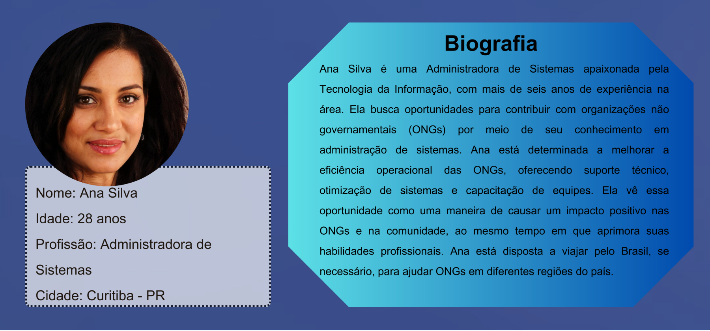
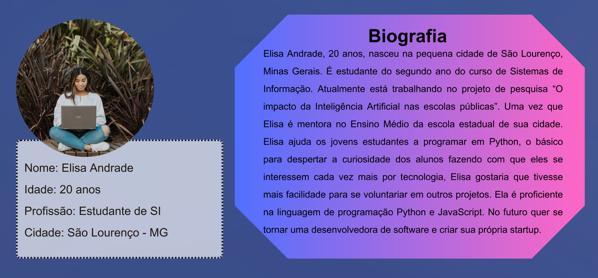
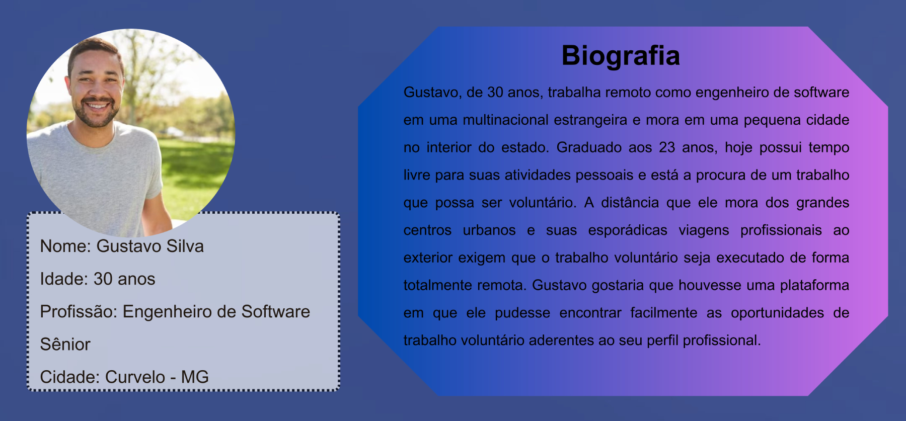

# Especificações do Projeto

Pensando em como os profissionais e estudantes da área de tecnologia podem contribuir com suas habilidades e conhecimentos em prol da comunidade, está sendo criada esta aplicação com o principal foco em conectar estes profissionais com ONGs de todo Brasil.

No processo de planejamento do projeto foram utilizados os seguintes passos: definição das personas mais coerentes para aplicação, mapeamento das necessidades e dores dos usuários e a criação dos requisitos que norteiam e definem o desenvolvimento do projeto.

Com os dados abaixo levantados será possível a elaboração da aplicação, cujo intuito é atender as demandas das ONGs aplicando os conhecimentos na área de tecnologia.

## Personas

## Histórias de Usuários

Com base na análise das personas forma identificadas as seguintes histórias de usuários:

|EU COMO... `PERSONA`| QUERO/PRECISO ... `FUNCIONALIDADE` |PARA ... `MOTIVO/VALOR`                 |
|--------------------|------------------------------------|----------------------------------------|
|Ana Silva  | Conectar profissionais e estudantes da área de tecnologia com ONGs de todo Brasil. | Para causar impacto positivo na sociedade. |
|Ana Silva  | Entender os desafios das ONGs.  | Para aprimorar suas habilidades profissionais. |
|Ana Lucia  | Preciso encontrar pessoas que possam se voluntariar.  | Para ajudar com as necessidades tecnológicas da ONG.  |
|Ana Lucia  | Quero poder encontrar voluntários remotamente.  | Para conseguir aumentar a quantidade de pessoas que se conectam à ONG.  |
|Elisa Andrade       | Quero me cadastrar para ser voluntária em ONGs.           | Aplicar os conhecimentos que estou adquirindo como estudante de Sistemas de Informação. |
|Elisa Andrade      | Quero encontrar ONGs de acordo com meu interesse e minha disponibilidade.                | Para me voluntariar em áreas do meu interesse com flexibilidade de horário.|
|Gustavo Silva  | Encontrar uma ONG.           | Poder ser voluntário aplicando meus conhecimentos como engenheiro de software.               |
|Gustavo Silva       | Poder me voluntariar de forma remota.                 | Permitir que eu possa ser voluntário da minha casa ou dos locais onde eu estiver viajando a trabalho. |
|Gustavo Silva       | Saber os detalhes da posição antes de me cadastrar.                 | Para que eu me candidate somente às posições que são de meu interesse e que correspondem às minhas habilidades. |
|Heitor Santos       | Saber a localização da ONG.        | Para que eu possa conciliar com minhas viagens.|
|Heitor Santos       | Datas de disponibilidade da ONG.   | Para que eu possa alinhar com meus projetos.|

## Requisitos

As tabelas que se seguem apresentam os requisitos funcionais e não funcionais que detalham o escopo do projeto.

### Requisitos Funcionais

|ID    | Descrição do Requisito  | Prioridade | Responsável |
|------|-----------------------------------------|----| ----|
|RF-001| A aplicação deve permitir que as ONGs se cadastrem. | ALTA |  |
|RF-002| A aplicação deve permitir que as ONGs atualizem suas informações de perfil, como contato e missão, a qualquer momento. | ALTA |  |
|RF-003| A aplicação deve possibilitar que as ONGs divulguem solicitações de ajuda técnica, descrevendo os projetos ou desafios específicos que precisam ser abordados. | ALTA |  |
|RF-004| A aplicação deve permitir que os voluntários visualizem as solicitações de ajuda técnica feitas pelas ONGs. | ALTA |  |
|RF-005| Os voluntários devem poder se voluntariar por meio de formulário de contato para trabalhar em projetos específicos das ONGs, indicando seu interesse e disponibilidade. | ALTA |  |
|RF-006| A aplicação deve permitir que as ONGs marquem as solicitações como concluídas ou encerradas. | ALTA |  |
|RF-007| A aplicação deve apresentar página com *feed* com as últimas demandas criadas pelas ONGs. | ALTA |  |
|RF-008| A aplicação deve apresentar a página “Como Começar” que orienta os visitantes sobre os passos necessários para se tornarem voluntários registrados na aplicação. | ALTA |  |
|RF-009| A aplicação deve fornecer um mecanismo de pesquisa para que os usuários possam encontrar ONGs com base em critérios como área de atuação, localização geográfica e necessidades específicas. | ALTA |  |
|RF-010| Deve existir uma página inicial (*landing page*) informativa que apresenta o propósito da plataforma e incentiva tanto as ONGs quanto os voluntários a utilizar a aplicação. | ALTA |  |
|RF-011| A aplicação deve conter a página “Perguntas Frequentes” que aborda as dúvidas mais comuns dos visitantes em relação ao voluntariado e ao uso da plataforma. | MÉDIA |  |
|RF-012| A aplicação deve permitir que as ONGs publiquem informações sobre suas conquistas e projetos bem-sucedidos, a fim de promover suas causas. | MÉDIA |  |
|RF-013| A aplicação deve apresentar a página “Sobre o Voluntariado”  que fornece informações detalhadas sobre o conceito de trabalho voluntário, destacando seu impacto positivo na sociedade e nas comunidades. | MÉDIA |  |
|RF-014| A aplicação deve apresentar a página “Por Que Ser Voluntário?” que apresenta histórias inspiradoras de voluntários e os benefícios pessoais que podem ser obtidos ao se envolver em ações voluntárias. | MÉDIA |  |
|RF-015| A aplicação deve apresentar a página “Histórias de Sucesso” que destaca projetos anteriores realizados por meio da plataforma, com resultados, depoimento de voluntários e o impacto positivo alcançado. | MÉDIA |  |
|RF-016| Os voluntários devem receber um email quando uma ONG expressa interesse em seu perfil. | MÉDIA |  |
|RF-017| As ONGs devem responder às candidaturas de usuários em até 3 dias. | BAIXA |  |
|RF-018| A aplicação deve apresentar páginas de recursos interativos, como quizzes ou testes de personalidade, que ajudem os visitantes a descobrirem em que áreas podem ser mais eficazes. | BAIXA |  |
|RF-019| A página da solicitação deve exibir uma lista de todos os voluntários que participaram. | BAIXA |  |
|RF-020| Na página da solicitação, deve haver um botão para solicitar depoimentos aos voluntários que envia um e-mail contendo um link a cada voluntário, solicitando que eles compartilhem um depoimento sobre sua experiência de participação | BAIXA |  |
|RF-021| A aplicação deve apresentar uma página para depoimento da solicitação que o voluntário participou, que só poderá ser acessada através do link recebido via email, com um formulário para preenchimento. | BAIXA |  |
|RF-022| Os depoimentos dos voluntários devem ser disponibilizados no perfil da ONG que fez a solicitação. | BAIXA |  |

### Requisitos não Funcionais

|ID     | Descrição do Requisito  |Prioridade |
|-------|-------------------------|----|
|RNF-001| A aplicação deve oferecer uma interface com design responsivo que se adapte aos dispositivos móveis e desktops. | ALTA |
|RNF-002| A aplicação deve apresentar um layout simples e de fácil utilização. |  ALTA |
|RNF-003| As senhas dos usuários devem ser criptografadas antes de serem armazenadas. |  ALTA |
|RNF-004| A aplicação deve fornecer feedback visual claro para ações do usuário, como confirmações de envio e mensagens de erro. |  ALTA |
|RNF-005| A aplicação deve responder às solicitações dos usuários com um tempo limite máximo de 3 segundos para carregar páginas ou processar ações. |  ALTA |
|RNF-006| O sistema deve ser capaz de estar disponível 99,9% do tempo, que se traduz em cerca de 8,76 horas de inatividade não planejada por ano. |  ALTA |
|RNF-007| O sistema deve ser capaz de ser executado nas versões mais recentes dos principais navegadores do mercado, como: Chrome, Firefox, Edge e Safari. |  ALTA |
|RNF-008| A comunicação entre voluntários e ONGs ocorrerá através de emails |  ALTA |

## Restrições

O projeto está restrito pelos itens apresentados na tabela a seguir.

|ID| Restrição                                                                                                                |
|--|--------------------------------------------------------------------------------------------------------------------------|
|01| O projeto deverá ser entregue até o final do semestre.                                                                   |
|02| Não pode ser desenvolvido um módulo de backend.                                                                          |
|03| Não será possível efetuar pagamentos pelo site.                                                                          |
|04| Cada ONG poderá cadastrar no máximo 1 conta por CNPJ.                                                                    |
|05| Cada ONG poderá ter apenas 2 demandas ativas por vez.                                                                    |
|06| Cada voluntário poderá se candidatar a apenas 2 demandas por vez.                                                        |
|07| A ONG deve aceitar ou recusar a candidatura do voluntário em até 3 dias, caso contrário será recusada automaticamente.   |
