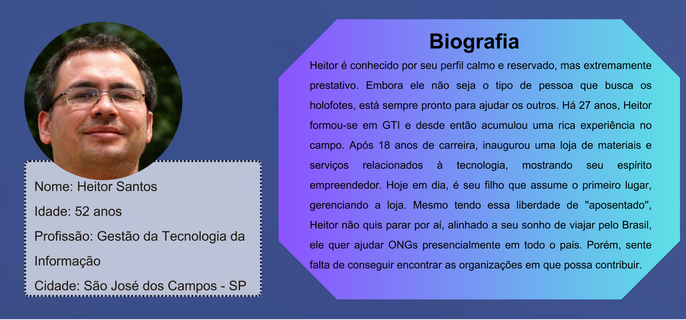

# Especificações do Projeto

Definição do problema e ideia de solução a partir da perspectiva do usuário. É composta pela definição do  diagrama de personas, histórias de usuários, requisitos funcionais e não funcionais além das restrições do projeto.

Apresente uma visão geral do que será abordado nesta parte do documento, enumerando as técnicas e/ou ferramentas utilizadas para realizar a especificações do projeto

## Personas

.

## Histórias de Usuários

Com base na análise das personas forma identificadas as seguintes histórias de usuários:

|EU COMO... `PERSONA`| QUERO/PRECISO ... `FUNCIONALIDADE` |PARA ... `MOTIVO/VALOR`                 |
|--------------------|------------------------------------|----------------------------------------|
|Usuário do sistema  | Registrar minhas tarefas           | Não esquecer de fazê-las               |
|Administrador       | Alterar permissões                 | Permitir que possam administrar contas |

Apresente aqui as histórias de usuário que são relevantes para o projeto de sua solução. As Histórias de Usuário consistem em uma ferramenta poderosa para a compreensão e elicitação dos requisitos funcionais e não funcionais da sua aplicação. Se possível, agrupe as histórias de usuário por contexto, para facilitar consultas recorrentes à essa parte do documento.

> **Links Úteis**:
> - [Histórias de usuários com exemplos e template](https://www.atlassian.com/br/agile/project-management/user-stories)
> - [Como escrever boas histórias de usuário (User Stories)](https://medium.com/vertice/como-escrever-boas-users-stories-hist%C3%B3rias-de-usu%C3%A1rios-b29c75043fac)
> - [User Stories: requisitos que humanos entendem](https://www.luiztools.com.br/post/user-stories-descricao-de-requisitos-que-humanos-entendem/)
> - [Histórias de Usuários: mais exemplos](https://www.reqview.com/doc/user-stories-example.html)
> - [9 Common User Story Mistakes](https://airfocus.com/blog/user-story-mistakes/)

## Requisitos

As tabelas que se seguem apresentam os requisitos funcionais e não funcionais que detalham o escopo do projeto.

### Requisitos Funcionais

|ID    | Descrição do Requisito  | Prioridade | Responsável |
|------|-----------------------------------------|----| ----|
|RF-001| A aplicação deve permitir que as ONGs se cadastrem | ALTA |  |
|RF-002| A aplicação deve permitir que as ONGs atualizem suas informações de perfil, como contato e missão, a qualquer momento. | ALTA |  |
|RF-003| A aplicação deve possibilitar que as ONGs postem solicitações de ajuda técnica, descrevendo os projetos ou desafios específicos que precisam ser abordados. | ALTA |  |
|RF-004| A aplicação deve permitir que os profissionais de TI visualizem as solicitações de ajuda técnica feitas pelas ONGs. | ALTA |  |
|RF-005| Os profissionais de TI devem poder se voluntariar por meio de formulário de contato para trabalhar em projetos específicos das ONGs, indicando seu interesse e disponibilidade. | ALTA |  |
|RF-006| A aplicação deve permitir que as ONGs marquem projetos como concluídos ou encerrados. | ALTA |  |
|RF-007| A aplicação deve apresentar página com *feed* com as últimas demandas criadas pelas ONGs. | ALTA |  |
|RF-008| ONGs devem responder às condidaturas de usuários em até 3 dias | ALTA |  |
|RF-009| Funcionalidade de email para que as ONGs e os profissionais de TI possam se comunicar. | ALTA |  |
|RF-010| A aplicação deve ter um sistema de notificações (e-mail) para informar os possíveis voluntários sobre novas solicitações de ajuda técnica criadas. | ALTA |  |
|RF-011| Os profissionais de TI devem receber notificações quando uma ONG expressa interesse em seu perfil. | ALTA |  |
|RF-012| A aplicação deve fornecer um mecanismo de pesquisa para que os usuários possam encontrar ONGs com base em critérios como área de atuação, localização geográfica e necessidades específicas. | ALTA |  |
|RF-013| Os profissionais de TI devem poder avaliar as ONGs e projetos com os quais colaboraram, fornecendo feedback e classificações. | ALTA |  |
|RF-014| Deve existir uma página inicial (landing page) informativa que apresenta o propósito da plataforma e incentiva tanto as ONGs quanto os profissionais de TI a se cadastrarem. | ALTA |  |
|RF-015| A aplicação deve conter páginas "Perguntas Frequentes" que aborda as dúvidas mais comuns dos visitantes em relação ao voluntariado e ao uso da plataforma. | ALTA |  |
|RF-016| A aplicação deve permitir que as ONGs publiquem informações sobre suas conquistas e projetos bem-sucedidos, a fim de promover suas causas. | ALTA |  |
|RF-017| A aplicação deve apresentar página "Sobre o Voluntariado" que fornece informações detalhadas sobre o conceito de trabalho voluntário, destacando seu impacto positivo na sociedade e nas comunidades. | ALTA |  |
|RF-018| A aplicação deve apresentar Página "Por Que Ser Voluntário?" que apresenta histórias inspiradoras de voluntários e os benefícios pessoais que podem ser obtidos ao se envolver em ações voluntárias. | ALTA |  |
|RF-019| A aplicação deve apresentar página "Como Começar" que orienta os visitantes sobre os passos necessários para se tornarem voluntários registrados na aplicação. | ALTA |  |
|RF-020| A aplicação deve apresentar Página "Histórias de Sucesso" que destaca projetos anteriores realizados por meio da plataforma, com resultados, depoimento de voluntários e impacto positivo alcançados. | ALTA |  |
|RF-021| A aplicação deve apresentar página de recursos interativos, como quizzes ou testes de personalidade, que ajudam os visitantes a descobrir em que áreas podem ser mais eficazes. | ALTA |  |

### Requisitos não Funcionais

|ID     | Descrição do Requisito  |Prioridade |
|-------|-------------------------|----|
|RNF-001| O sistema deve ser responsivo para rodar em um dispositivos móvel | MÉDIA | 
|RNF-002| Deve processar requisições do usuário em no máximo 3s |  BAIXA | 

Com base nas Histórias de Usuário, enumere os requisitos da sua solução. Classifique esses requisitos em dois grupos:

- [Requisitos Funcionais
 (RF)](https://pt.wikipedia.org/wiki/Requisito_funcional):
 correspondem a uma funcionalidade que deve estar presente na
  plataforma (ex: cadastro de usuário).
- [Requisitos Não Funcionais
  (RNF)](https://pt.wikipedia.org/wiki/Requisito_n%C3%A3o_funcional):
  correspondem a uma característica técnica, seja de usabilidade,
  desempenho, confiabilidade, segurança ou outro (ex: suporte a
  dispositivos iOS e Android).
Lembre-se que cada requisito deve corresponder à uma e somente uma
característica alvo da sua solução. Além disso, certifique-se de que
todos os aspectos capturados nas Histórias de Usuário foram cobertos.

## Restrições

O projeto está restrito pelos itens apresentados na tabela a seguir.

|ID| Restrição                                             |
|--|-------------------------------------------------------|
|01| O projeto deverá ser entregue até o final do semestre |
|02| Não pode ser desenvolvido um módulo de backend        |

Enumere as restrições à sua solução. Lembre-se de que as restrições geralmente limitam a solução candidata.

> **Links Úteis**:
> - [O que são Requisitos Funcionais e Requisitos Não Funcionais?](https://codificar.com.br/requisitos-funcionais-nao-funcionais/)
> - [O que são requisitos funcionais e requisitos não funcionais?](https://analisederequisitos.com.br/requisitos-funcionais-e-requisitos-nao-funcionais-o-que-sao/)
