# Projeto de Interface

O user flow da aplicação inclui todas as telas, permitindo uma visualização detalhada de cada etapa que o usuário percorrerá durante o uso.

## User Flow

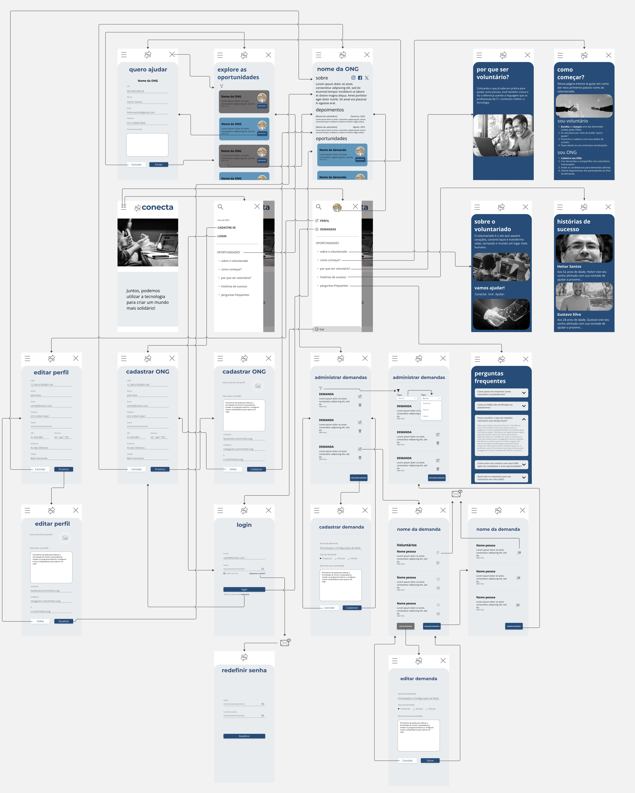

## Wireframes

### Cadastrar ONG:

Wireframe que atende aos:

RF-001 - A aplicação deve permitir que as ONGs se cadastrem.

RF-002 - A aplicação deve permitir que as ONGs gerenciem suas informações de perfil (alterar, excluir e consultar os dados) a qualquer momento.

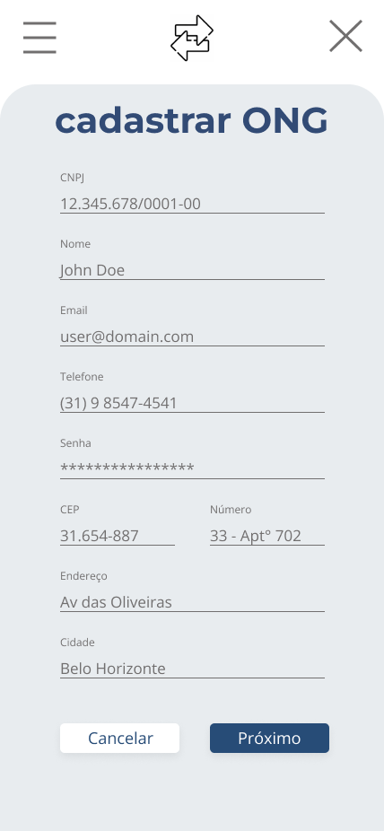

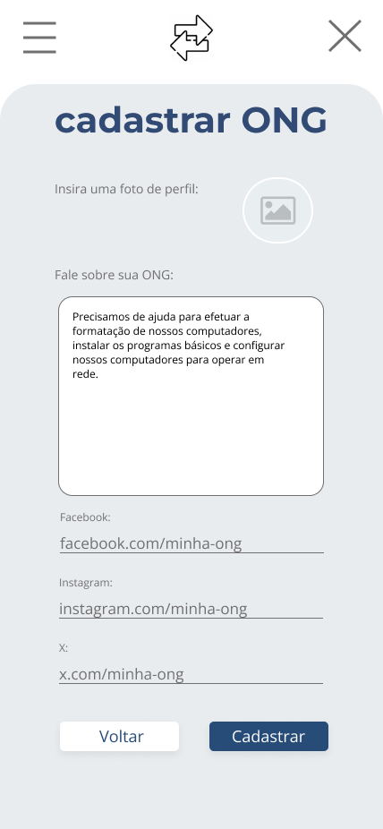

### Cadastrar demanda da ONG:

Wireframe que atende ao: 

RF-003 - A aplicação deve possibilitar que as ONGs divulguem solicitações de ajuda técnica, descrevendo os projetos ou desafios específicos que precisam ser abordados.

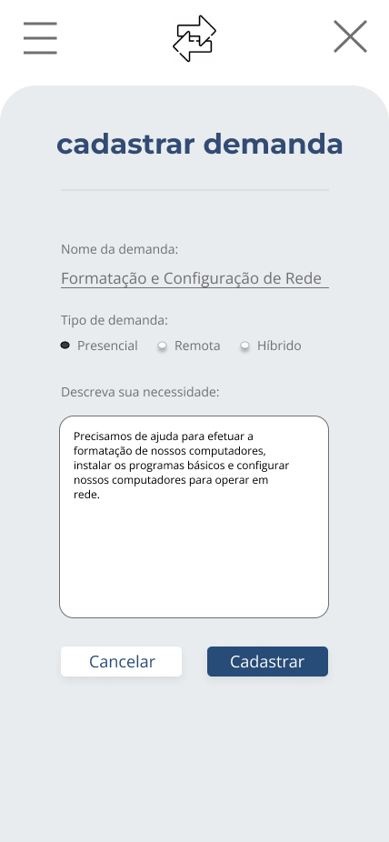

### Candidatar-se a uma demanda:

Wireframe que atende ao: 

RF-005 - Os voluntários devem poder se voluntariar por meio de formulário de contato para trabalhar em projetos específicos das ONGs, indicando seu interesse e disponibilidade.

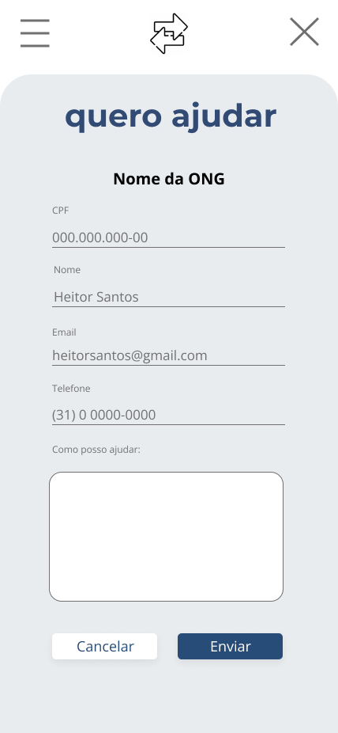

### Página de demandas:

Wireframe que atende aos: 

RF-004 - A aplicação deve permitir que os voluntários visualizem as solicitações de ajuda técnica feitas pelas ONGs.

RF-007 - A aplicação deve apresentar página contendo as últimas demandas criadas pelas ONGs.

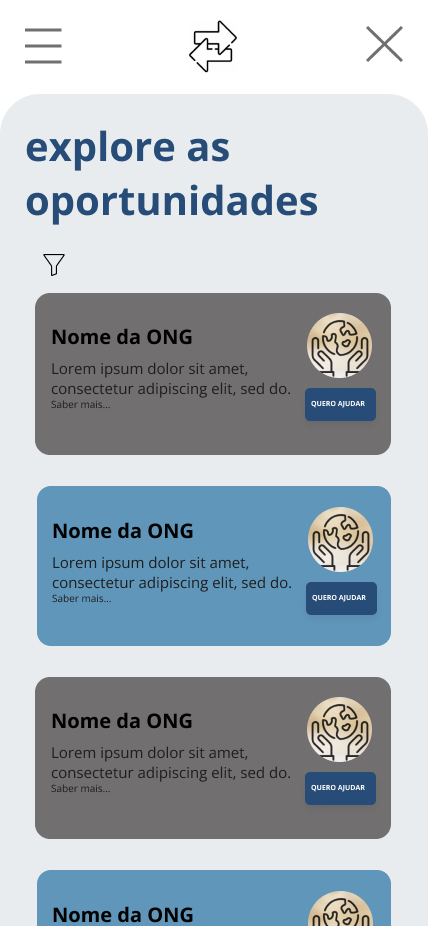

### Como Começar:

Wireframe que atende ao:

RF-008 - A aplicação deve apresentar a página “Como Começar” que orienta os visitantes sobre os passos necessários para se tornarem voluntários registrados na aplicação.

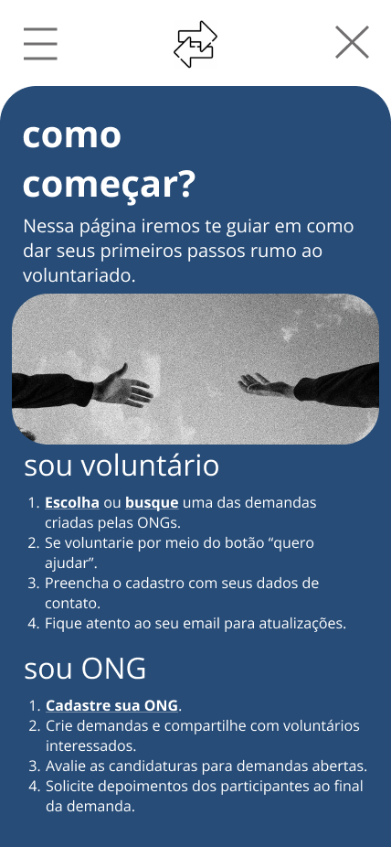

### Landing Page:

Wireframe que atende ao:

RF-009 - Deve existir uma página inicial (landing page) informativa que apresenta o propósito da plataforma e incentiva tanto as ONGs quanto os voluntários a utilizar a aplicação.

### Perguntas Frequentes:

Wireframe que atende ao: 

RF-010 - A aplicação deve conter a página “Perguntas Frequentes” que aborda as dúvidas mais comuns dos visitantes em relação ao voluntariado e ao uso da plataforma.

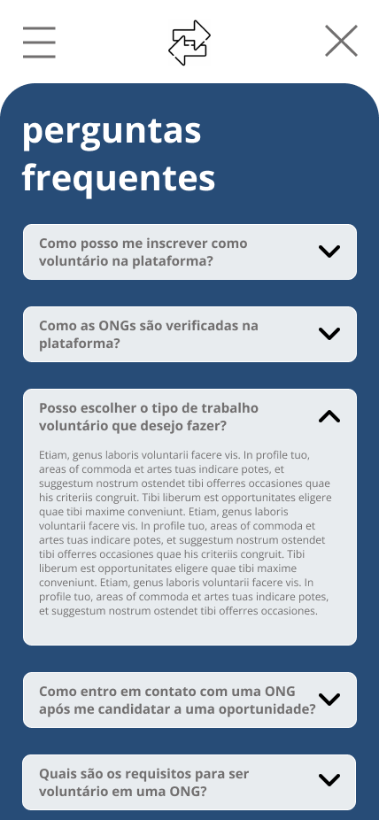

### Sobre o Voluntariado:

Wireframe que atende ao:

RF-011 - A aplicação deve apresentar a página “Sobre o Voluntariado” que fornece informações detalhadas sobre o conceito de trabalho voluntário, destacando seu impacto positivo na sociedade e nas comunidades.

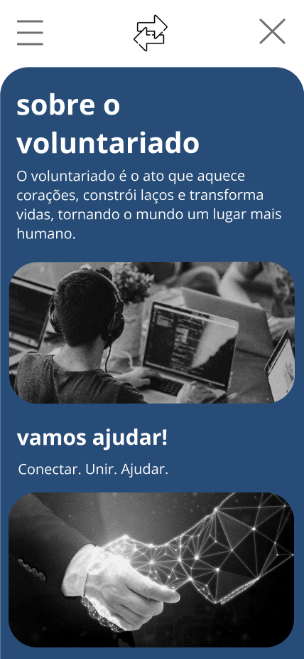

### Por Que Ser Voluntário:

Wireframe que atende ao: 

RF-012	A aplicação deve apresentar a página “Por Que Ser Voluntário?” que apresenta os benefícios pessoais que podem ser obtidos ao se envolver em ações voluntárias.

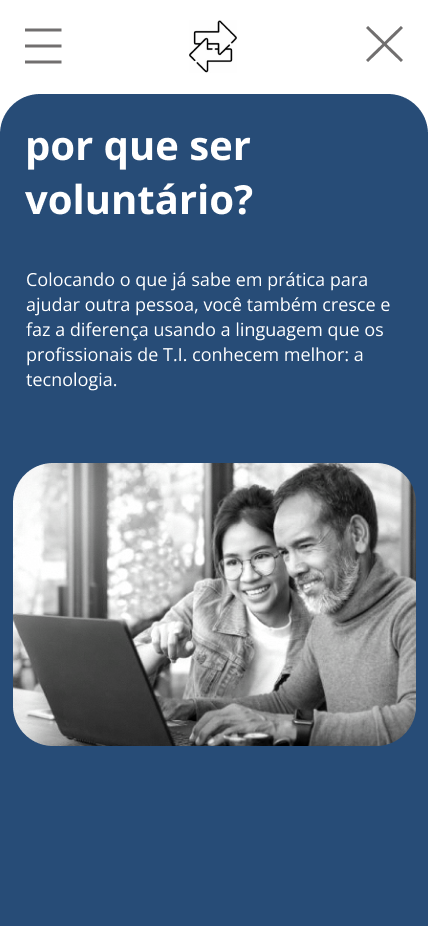

### Histórias de Sucesso:

Wireframe que atende ao: 

RF-013 - A aplicação deve apresentar a página “Histórias de Sucesso” que destaca projetos anteriores realizados por meio da plataforma, com resultados, depoimentos de voluntários e o impacto positivo alcançado.

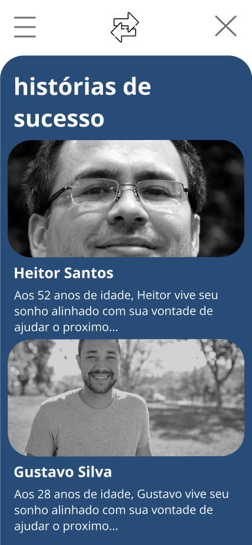

### Filtro:

Wireframe que atende ao:

RF-014	A aplicação deve fornecer um mecanismo de filtro para que os usuários possam encontrar demandas com base em critérios como: remoto, presencial, estado do Brasil e palavras-chave.

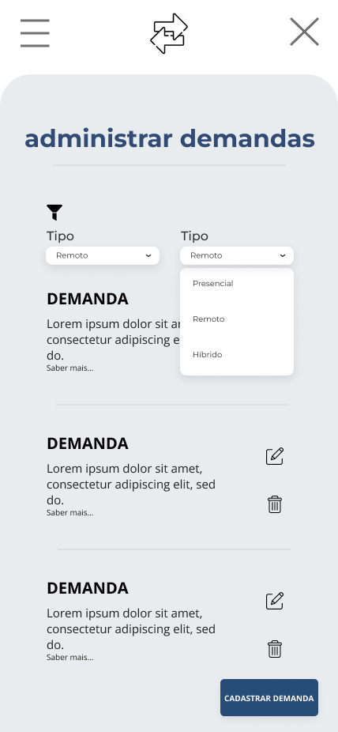

### Administrar uma demanda:

Wireframe que atende aos:

RF-006 - A aplicação deve permitir que as ONGs marquem as solicitações como concluídas ou encerradas.

RF-015 - Os voluntários devem receber um e-mail quando uma ONG expressa interesse em seu perfil.

RF-018 - A página da demanda cadastrada pela ONG deve exibir uma lista de todos os voluntários que tiveram a candidatura aceita.

RF-019 - Na página da demanda cadastrada pela ONG, deve ter um botão com a finalidade de enviar um link via e-mail aos voluntários solicitando a eles que deixem um comentário sobre sua experiência.

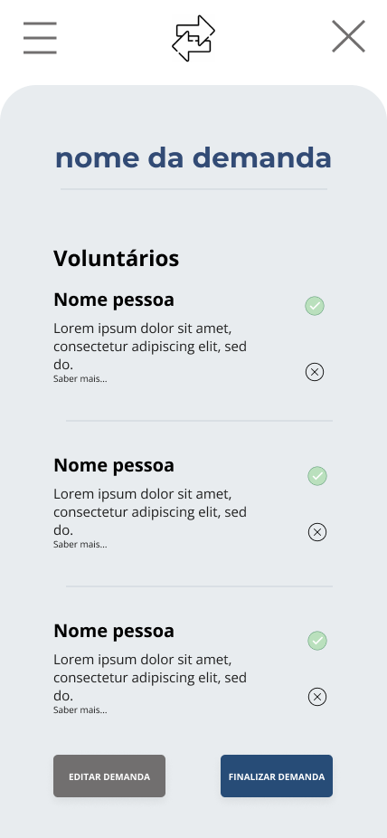

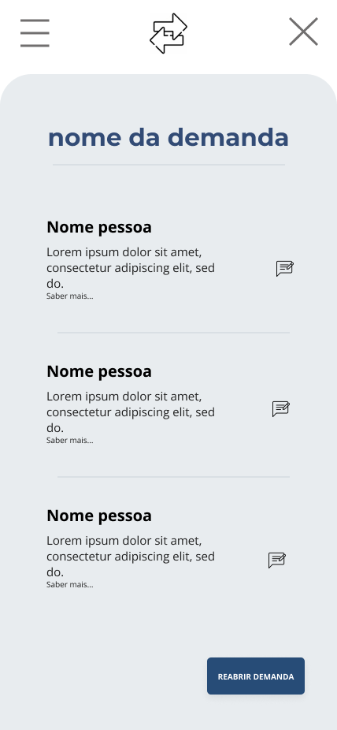

### Cadastrar depoimento:

Wireframe que atende ao:

RF-020 - A aplicação deve apresentar uma página para depoimento da solicitação que o voluntário participou, que só poderá ser acessada através do link recebido via e-mail, com um formulário para preenchimento.

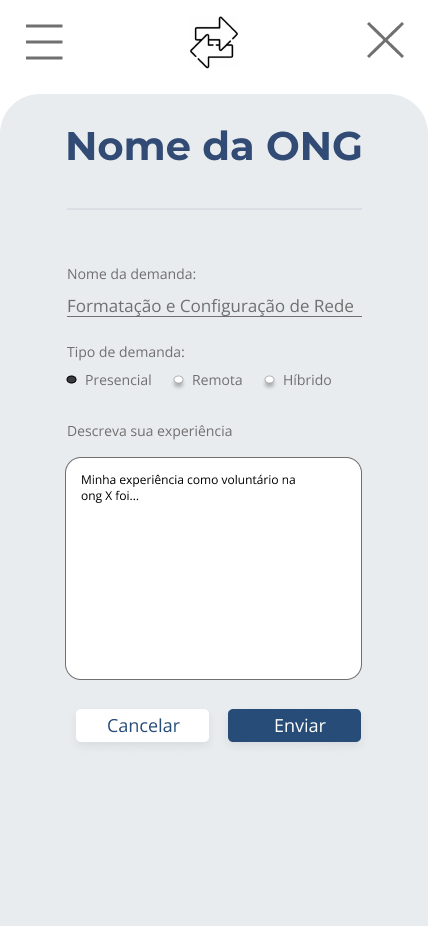

### Página da ONG:

Wireframe que atende ao:

RF-021	Os depoimentos dos voluntários devem ser disponibilizados no perfil da ONG que fez a solicitação.

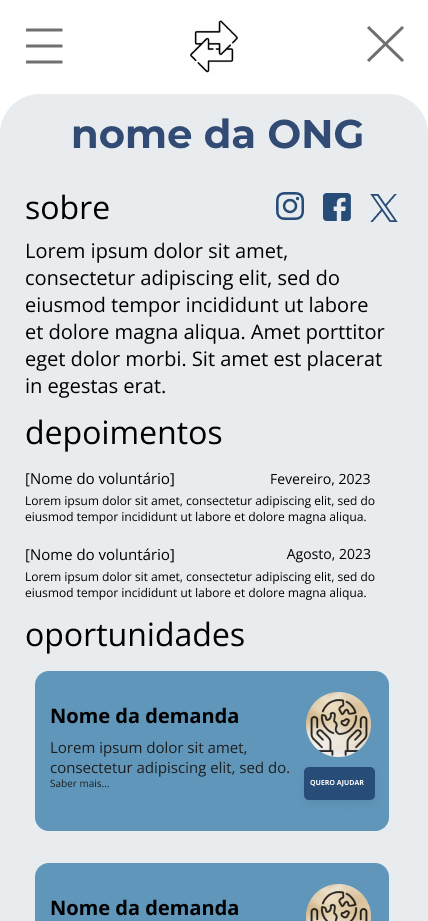
