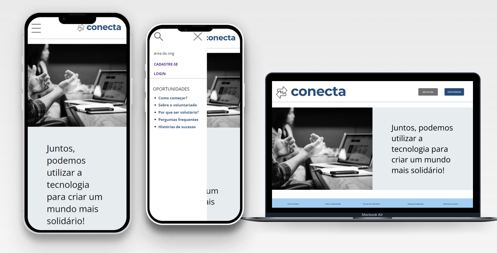
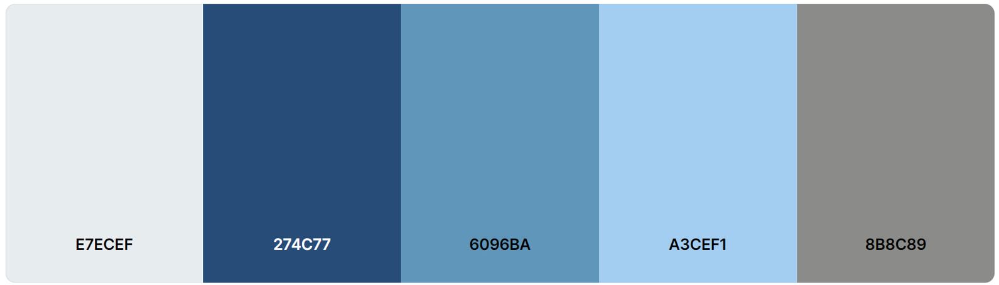
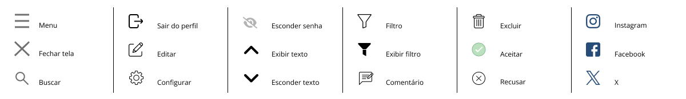

# Template padrão do site

A aplicação é projetada com o usuário em mente, apresentando um visual minimalista, uma paleta de cores neutras e uma interface simples e amigável para garantir uma interação intuitiva e agradavel.

## Design

O design do nosso projeto, centrado na conexão de pessoas, é cuidadosamente concebido para transmitir uma experiência agradável e intuitiva. Utiliza uma paleta de cores calmas e claras, com destaque para tons pastéis, e adota cantos arredondados em seus elementos, proporcionando uma estética suave e amigável. Ícones minimalistas, representando funcionalidades de forma simplificada, são integrados. A logo é composta de duas setas, reforçando a ideia central de conexão, mantendo coerência com as cores e a simplicidade visual do design global. Esperamos que esse design proporcione uma experiência envolvente e harmoniosa, enfatizando a importância da interligação entre as pessoas. 

## Cores

Definimos as cores de tons de azul como cores principais do produto, pois comumente está ligada a confiança, calma, estabilidade e confiabilidade. Essas são qualidades essenciais para qualquer plataforma que lida com organizações sem fins lucrativos e voluntários, uma vez que a confiança é fundamental para o sucesso dessas parcerias. O azul é uma cor que também evoca a natureza, como o céu e a água. Isso pode ser interpretado como uma conexão com o ambiente natural e a sustentabilidade, valores que muitas ONGs promovem. Heller(2021)[[5]](../docs/references.md) também sugere que o azul está relacionado à tecnologia e sendo uma plataforma digital que liga pessoas de tecnologia às ONGs que necessitam desta demanda, a predominação do azul e uma escolha assertiva.

## Tipografia

A tipografia utilizada para o site é a Open Sans para os textos e Montserrat Mono para os títulos da página. 

## Iconografia

Estes são os ícones utilizados no site. 

