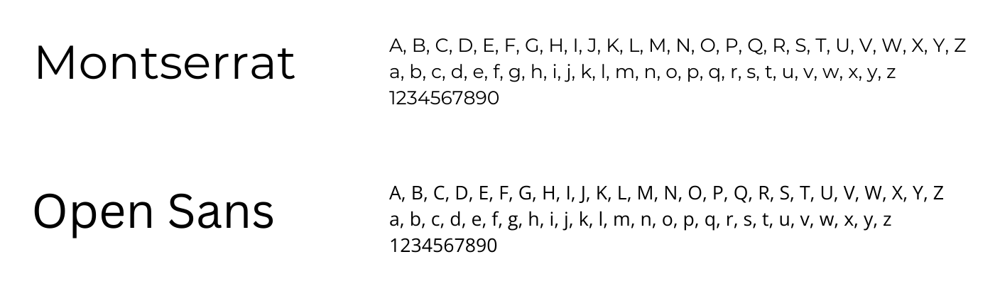

# Template padrão do site

A aplicação é projetada com o usuário em mente, apresentando um visual minimalista, uma paleta de cores neutras e uma interface simples e amigável para garantir uma interação intuitiva e agradavel.

## Design

O logo foi feito pensando no conceito de conectar pessoas, utilizando as cores escolhidas para o desenvolvimento do site. 

## Cores

A paleta de cores utilizada na aplicação contém tons predominantemente de azul e cinza. 

## Tipografia

A tipografia utilizada para o site é a Open Sans para os textos e Montserrat Mono para os títulos da página. 

## Iconografia

Estes são os ícones utilizados no site. 

