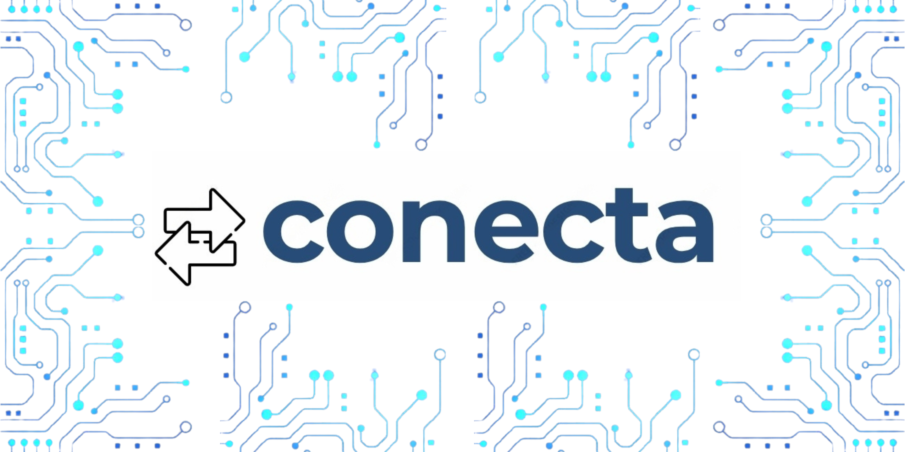

# Apresentação

Essa é a apresentação do site que foi desenvolvido para esse projeto, Conecta.

Na apresentação inicial foram definidos o problema que seria abordado no projeto, os objetivos que gostaríamos de alcançar durante o desenvolvimento da aplicação e foram trazidos também os requistios funcionais.

Na apresentação final, trazemos os objetivos e o problema que foram resolvidos durante o desenvolvimento da aplicação e também um vídeo em que é possível observar o site em funcionamento.

* [Conecta - Pitch inicial](./conecta-primeira-apresentacao.pdf)

* [Conecta - Apresentação final](./conecta-apresentacao-final.pdf)

* [Conecta - Vídeo de demonstração](./conecta-apresentacao-final-video.mp4)

## Título do Projeto

Conecta

## Identidade Visual (Marca, Design)

## Conjunto de Slides (Estrutura)

* [Conecta - Apresentação final- slides](./conecta-apresentacao-final-slides.pdf)

## Vídeo de demonstração

* [Conecta - Apresentação final- video](./conecta-apresentacao-final-video.mp4)

